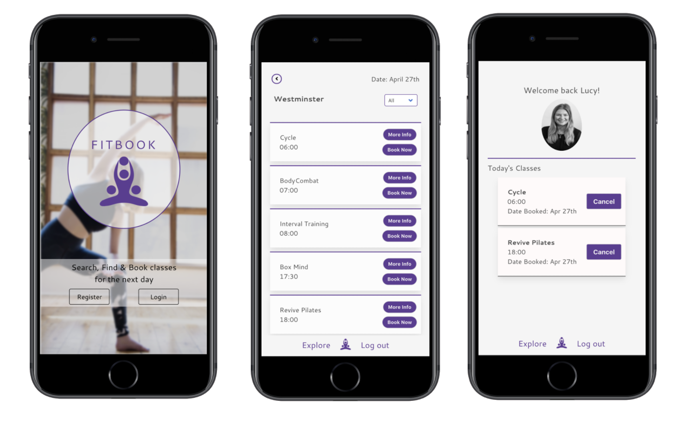
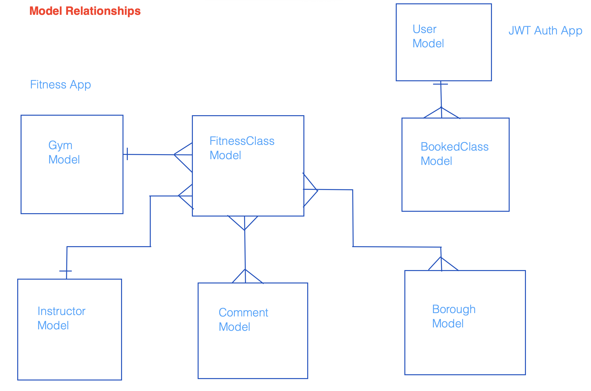
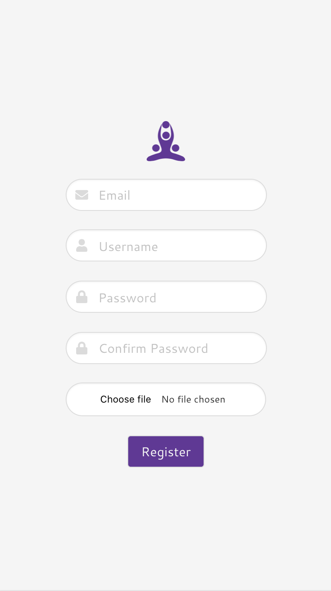
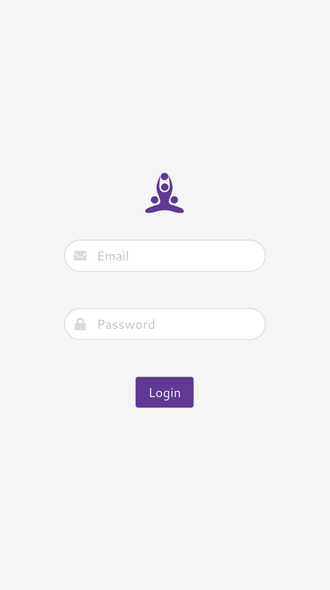
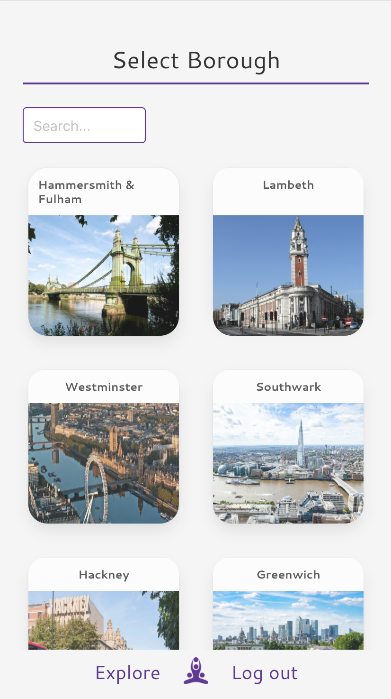
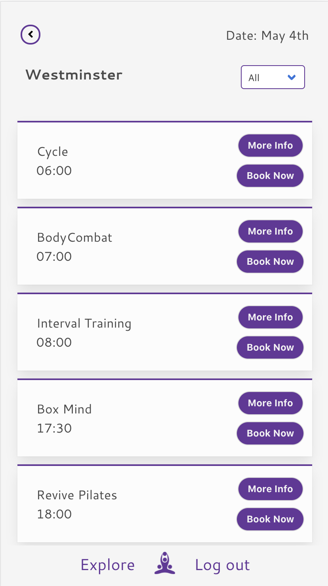
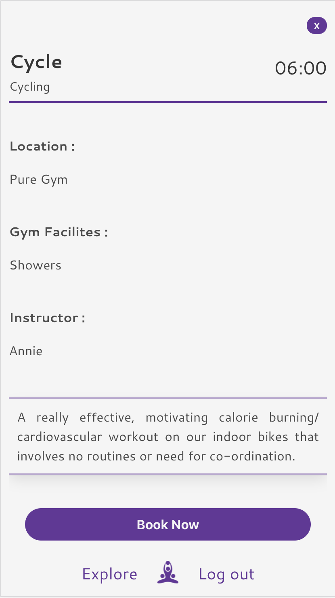
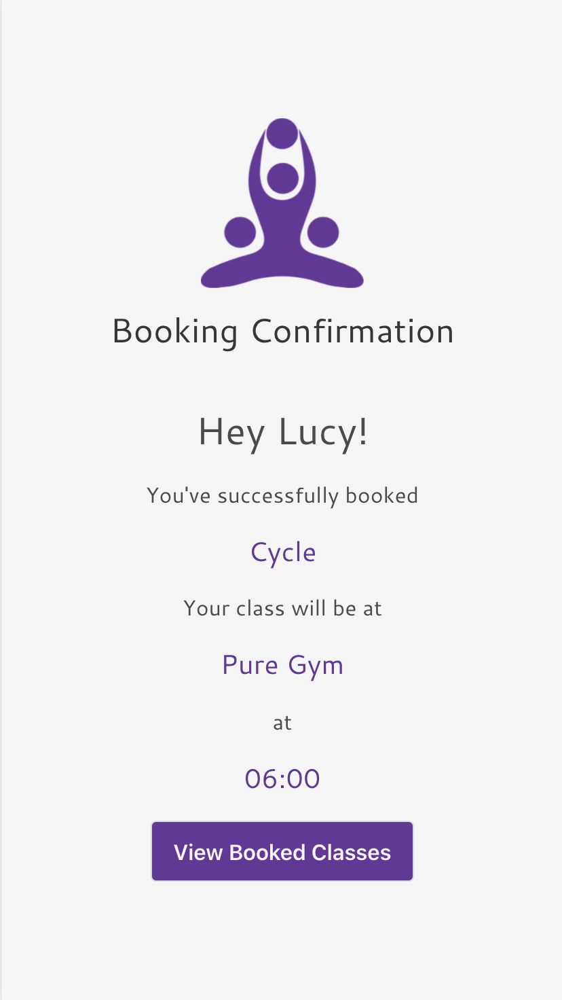
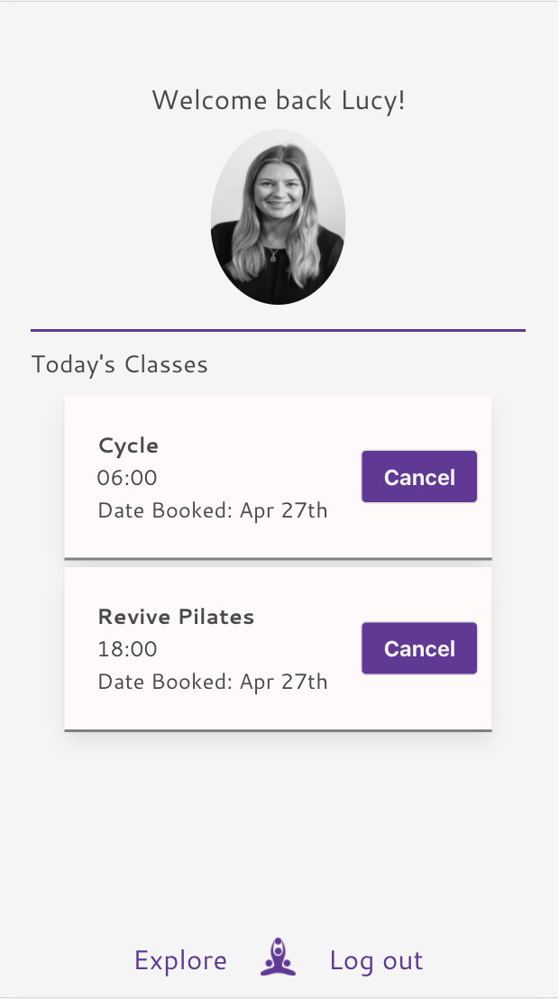

##  General Assembly, Software Engineering Immersive
# Fitbook

by [Lucy Maitland](https://github.com/lucymait) and [Annie Kayal](https://github.com/annie-kayal)

 <br/>

## Overview

Fitbook was my fourth project, with General Assembly, during the software engineering immersive course. Myself and Annie chose to work in a pair, to build a full-stack application within **one week**.

After lots of planning, we decided to create a fitness class booking app, where users can:

- Search, Find & Book Fitness classes
- View a list of fitness classes, in your area and filter by activity-type (Yoya, Boxing, HIIT etc.)
- Book any fitness class and view their booking, in their profile page

Check out the top fitness classes in your area, [here](https://fitbook-fitness.herokuapp.com/#/).

**Please note:** Due to the Heroku deficiency, Heroku is unable to upload images in our Registration Form. When using the app on Heroku, you will be unable to upload a photo, however we have implemented a default image to be present when an image is not uploaded. On the other hand, we have proof this works locally, please see below in our ReadMe.

## Brief

- Choose to work solo or in a team
- **Build a full-stack application** by making a backend and a front-end
- **Use a Python Django API** using Django REST Framework to serve data from a Postgres database
- **Consume the API with a separate front-end** built with React
- **Be a complete product** which most likely means multiple relationships and CRUD functionality for at least a couple of models
- **Be deployed online** so it's publicly accessible

## Technologies Used

- JavaScript (ES6)
- React.js
- Python
- Django
- PostgreSQL
- HTML
- CSS, SCSS
- Bulma
- Axios
- Webpack
- Git and GitHub
- Heroku
- Moment
- Google Fonts

# Backend

## Approach 

When building our project, Django created a main project folder (for us) which contains all the project URLS and settings, including the database configuration. It also comes with a built-in CMS where the user can directly add, update and delete database records, and pre made authentication. 

First, we had to create a superuser in order to view the admin user section. Next we created our app (fitness) which is part of the project and has its own set of URLS, models, views and serializers. We could link our app into the Django project by modifying some settings in the project folder.

### Planning

In the first stage, we created our Entity Relationship Diagram (as seen below). This illustrated the different relationships between each model, whether its a one-to-many or many-to-many relationship. It was important deciding the relationships at an early stage, so that our models and database weren't affected. 

 <br/>


## Models

It was crucial creating our models at stage 1, to reduce having to drop your database and losing any crucial data.

### 1. FITNESS

For the PostgreSQL database, we created five tables: Instructor, Gym, Fitness Class, Borough & Booked Class.

- The Instructor table consisted of a name so we could identify the instructor for each fitness class.
```js
class Instructor(models.Model):
  name = models.CharField(max_length=100)

  def __str__(self):
    return f'{self.name}'
```
- The Gym table also consisted of a name, but in addition, had a facilities field, e.g. parking, showers or lockers.
```js
class Gym(models.Model):
  name = models.CharField(max_length=500)
  facilities = models.CharField(max_length=400)

  def __str__(self):
    return f'{self.name}'
```
- The Fitness Class table was our main model. This consisted of a fitness class name, gym, activity_type, instructor, description, time_of_class and comments. 

- A comments model was created at an early stage (as a bonus feature); however, we unfortunately ran out of time and therefore didn't implement it. Although, now that it is in our models, it will make it much easier for the feature to be created in the future, as we already have the model in our backend.

- The FitnessClass model, had the following relationships: 
1. A one-to-many relationship with gym, signifying many fitness classes to one gym;
2. A one-to-many relationship with instructor, signifying many fitness classes to one instructor;
3. A many-to-many relationship with comments, signifying there can be many comments to many fitness classes.

```js
class FitnessClass(models.Model):
  name = models.CharField(max_length=200)
  gym = models.ForeignKey(Gym, related_name='fitness', on_delete=models.CASCADE)
  activity_type = models.CharField(max_length=500)
  instructor = models.ForeignKey(Instructor, related_name='fitness', on_delete=models.CASCADE)
  description = models.CharField(max_length=1000)
  time_of_class = models.CharField(max_length=200)
  comment = models.ManyToManyField(Comment, related_name='fitness', blank=True)

  def __str__(self):
    return f'{self.name}'
```
- The Borough table consisted of a name, image and fitnessclasses. The fitnessclass had a many-to-many relationship to Boroughs, showing that there are many fitness classes in many boroughs.

```js
class Borough(models.Model):
  name = models.CharField(max_length=200)
  image = models.CharField(max_length=1000)
  fitnessclass = models.ManyToManyField(FitnessClass, related_name='fitness', blank=True)

  def __str__(self):
    return f'{self.name}'
```
- Finally our BookedClass table consisted of a name, gym, activity_type, instructor, description, time_of_class, date booked and user. 

- The bookedClass model has a one to many relationship with the user model, from the JWT Auth App. This shows that each user can have many booked classes. These booked classes will then be displayed in the users profile, in the front end.

```js
class BookedClass(models.Model):
  name = models.CharField(max_length=200)
  gym = models.CharField(max_length=200)
  activity_type = models.CharField(max_length=500)
  instructor = models.CharField(max_length=200)
  description = models.CharField(max_length=1000)
  time_of_class = models.CharField(max_length=200)
  data_booked = models.CharField(max_length=100)
  user = models.ForeignKey(User, related_name='fitness', on_delete=models.CASCADE)

  def __str__(self):
    return f'{self.name}'
```

### 1. JWT_AUTH

Django provided us with a basic User; however, we extended this by adding an image and email field. The image field was 'blank=true" and therefore it was not necessary for the user to provide one upon registration. It is this user model, which has a relationship with our bookedClass model in our Fitness App.

```js
class User(AbstractUser):
  image = models.ImageField(upload_to='profile_image', blank=True)
  email = models.EmailField(unique=True, error_messages={'unique':"This email has already been registered."})
  ```
## Serializers

- The serializer sits in front of the model, it validates the data coming from the client, before it reaches the model, and it also serialises the data (turns it into a JSON string) after the model has retrieved the data from the database.

- The model property indicates which model the serializer should base its serialisation on, and the fields property defines which fields should be output to the JSON string, or be included when validating the data from the client.

### 1. JWT_AUTH

- We created a user serializer that will check that the password and password_confirmation fields match, if they do not match, we send a validation error to the user. 

- We used Django's built in validate_password method that checks the strength of the password. This is the same method used when creating a super user in the terminal. It ensures that passwords aren't too weak. 

- Finally, we hashed the password using Django's in-built make_password function, and stored it back on the data object. This will become the serializer.data property and will ultimately get stored in the database.

```js
class UserSerializer(serializers.ModelSerializer):

    password = serializers.CharField(write_only=True)
    password_confirmation = serializers.CharField(write_only=True)

    def validate(self, data):

        password = data.pop('password')
        password_confirmation = data.pop('password_confirmation')

        if not password:
            raise serializers.ValidationError({'password': 'Not a valid Password'})

        if password != password_confirmation:
            raise serializers.ValidationError({'password_confirmation': 'Passwords do not match'})

        try:
            validations.validate_password(password=password)
        except ValidationError as err:
            raise serializers.ValidationError({'password': err.messages})

        data['password'] = make_password(password)
        return data 

    class Meta:
        model = User
        fields = ('id', 'username', 'email', 'image', 'password', 'password_confirmation','fitness')
        extra_kwargs = {
          'fitness' : {'required': False}
        }
```

### 2. FITNESS

- We can now use our serializers in the view, to not only convert the database data into JSON, but also to turn the client request data into model instances ready to be saved to the database.

- The model property indicates which model the serializer should base its serialisation on, and the fields property defines which fields should be output to the JSON string, or be included when validating the data from the client.

```js
class FitnessClassSerializer(serializers.ModelSerializer):
  class Meta:
    model = FitnessClass
    fields = ('id', 'name', 'gym', 'activity_type', 'instructor', 'time_of_class', 'description', 'comment')
```

- As our FitnessClass Serializer and Borough Serializer have nested relationships within their models, we had to populate the serializers in order to display the nested data. 

```js
class PopulateFitnessClassSerializer(serializers.ModelSerializer):
  instructor = InstructorSerializer()
  gym = GymSerializer()
  comment = CommentSerializer(many=True)

  class Meta:
    model = FitnessClass
    fields = ('id', 'name', 'gym', 'activity_type', 'instructor', 'time_of_class', 'description', 'comment')

class PopulateBoroughSerializer(serializers.ModelSerializer):
  fitnessclass = PopulateFitnessClassSerializer(many=True, required=False)

  class Meta:
    model = Borough
    fields = ('id', 'name', 'image', 'fitnessclass')
```

## Views

The views in each app, highlighted our API End-points. 

### 1. JWT_AUTH (User)

- /register only has a post route, where the user's data is received and stored in the database.

```js
class RegisterView(CreateAPIView):
    serializer_class = UserSerializer
    def post(self, request):
        serializer = UserSerializer(data=request.data)
        if serializer.is_valid():
            serializer.save()
            return Response({'message': 'Registration successful'})
        return Response(serializer.errors, status=422)
 ```

 - /login has a get and post route, where the user's login information is received, checked and, if valid, a JWT token is returned as response.

```js
class LoginView(APIView):
    def get_user(self, email):
        try:
            return User.objects.get(email=email)
        except User.DoesNotExist:
            raise PermissionDenied({'message': 'Not Registered'})
    def post(self, request):
        email = request.data.get('email')
        password = request.data.get('password')
        user = self.get_user(email)
        if not user.check_password(password):
            raise PermissionDenied({'message': 'Incorrect Password'})
        token = jwt.encode({'sub': user.id}, settings.SECRET_KEY, algorithm='HS256')
        return Response({'token': token, 'message': f'Welcome back {user.username}!'})
```
- /profile has a GET, PUT and DELETE route, all relating to the user data of the user currently logged in, allowing them to respectively fetch, amend and delete their profile information.

```js
class ProfileView(APIView):
  permission_classes = (IsAuthenticated, )
  def get(self, request):
    user = User.objects.get(pk=request.user.id)
    serialized_user = PopulateUserSerializer(user)
    return Response(serialized_user.data)
```
### 2. FITNESS

- All our views in our Fitness App used the API view from rest_framework. 

- Here are the URLs for our fitness app views:

``` js
urlpatterns = [
  path('', AllFitnessClassView.as_view()),
  path('<int:pk>/', FitnessClassDetailView.as_view()),
  path('borough/', AllBoroughView.as_view()),
  path('borough/<int:pk>/', BoroughDetailView.as_view()),
  path('gym/', AllGymView.as_view()),
  path('gym/<int:pk>/', GymDetailView.as_view()),
  path('comment/', AllCommentView.as_view()),
  path('comment/<int:pk>/', CommentDetailView.as_view()),
  path('bookedclass/', BookedClassesView.as_view()),
  path('bookedclass/<int:pk>/', BookedClassDetailView.as_view())
]
```

- Django REST Framework comes with some powerful built-in permissions. They are very simple to use and can be added any view by passing them as a list or tuple to a permission_classes property.

- IsOwnerOrReadOnly allows an unauthenticated user read only access eg: INDEX and SHOW, but only allows unsafe access, e.g. CREATE, UPDATE and DELETE to Owner.

```js
class IsOwnerOrReadOnly(BasePermission):
  def has_object_permission(self, request, view, obj):
    if request.method in permissions.SAFE_METHODS:
      return True
    
    return request.user == obj.user
```

- As the admin is the only person who can post, delete and put any of the data (from the admin panel), we decided the user will only need a get route on all our views, apart from the Booked Class View.

- The AllFitnessClassView gets all the fitness classes, whereas the FitnessClassDetailView gets a single fitness class.

```js
class AllFitnessClassView(APIView):
  permission_classes = (IsOwnerOrReadOnly,)

  def get(self, request):
    fitness_classes = FitnessClass.objects.all()
    self.check_object_permissions(request, fitness_classes)
    serializer = PopulateFitnessClassSerializer(fitness_classes, many=True)
    return Response(serializer.data)

class FitnessClassDetailView(APIView):
  permission_classes = (IsOwnerOrReadOnly,)

  def get(self, request, pk):
    fitness_class = FitnessClass.objects.get(pk=pk)
    self.check_object_permissions(request, fitness_class)
    serializer = PopulateFitnessClassSerializer(fitness_class)
    return Response(serializer.data)
```
- The BookedClass View has a route for posting to the booked classes endpoint, as well as getting and deleting a single booked class.

```js
class BookedClassesView(APIView):
  # queryset = BookedClass.objects.all()
  # serializer_class = BookedClassSerializer
  permissions_classes = (IsAuthenticated, )

  def post(self, request):
    request.data['user'] = request.user.id
    booked_class = BookedClassSerializer(data = request.data)
    if booked_class.is_valid():
      booked_class.save()
      return Response(booked_class.data, status=HTTP_202_ACCEPTED)
    return Response(status=HTTP_422_UNPROCESSABLE_ENTITY)

class BookedClassDetailView(APIView):
  def get(self, request, pk):
    booked_class = BookedClass.objects.get(pk=pk)
    serializer = BookedClassSerializer(booked_class)
    return Response(serializer.data)

  def delete(self, request, pk):
    booked_class = BookedClass.objects.get(pk=pk)
    booked_class.delete()
    return Response(status=HTTP_204_NO_CONTENT)
```

# Frontend

Having completed our custom built API and ensuring all the relevant information was displaying correctly, focus could now be placed on the UX perspective. Before diving into building the pages, a user story needed to be conceptualized to ensure a smooth and functional app from the user view. 
<div style='text-align:center'>

</div>

Once we were clear on how the user journey would be made, we quickly got started on building our React components.

The nature of this app was to primarily be used on **mobile apps** as users would be likely to view class availability during their day. Because of this, the app was designed to be mobile first. We implemented using a CSS framework into our project in order to focus on the functionality of how the components would work.

## Homepage 

- The homepage was built with limited accessibility for users. In designing our backend, content would only be available to users who had created an account. The landing page therefore prompts users to either create an account or to login using buttons to redirect them to the appropriate page. 
 
<div style='text-align:center'>

</div>

## Registering 

Depending on what the user has selected from the landing page, a redirection is made to either the register or login components. 

- We wanted to be able to allow users to upload their own individual profile pictures to our database which renders in their profile. This was a strict piece of code which unfortunately was unable to be deployed to Heroku as their database ignores image files.

- However, this was achieved locally: 

```js 
    const body = new FormData()

  function handleSubmit(event) {
    event.preventDefault()
    const imageInput = document.getElementsByClassName('image-field')
    const image = imageInput.image.files
    body.append('email', registerData.email)
    body.append('username', registerData.username ? registerData.username : '')
    body.append('password', registerData.password ? registerData.password : '')
    body.append('password_confirmation', registerData.password_confirmation ? registerData.password_confirmation : '')
    body.append('image', image.length === 0 ? registerData.image : image[0])
    axios.post('/api/register',
      body)
      .then(() => {
        const login = new FormData()
        login.append('email', registerData.email)
        login.append('password', registerData.password)
        axios.post('/api/login', login)
          .then(resp => {
            auth.setToken(resp.data.token)
            props.history.push('/profile')
          })
      })
      .catch(err => {
        setErrors(err.response.data)
      })
  }
```

  - To enable this feature for our users, an important aspect was **accessing the file uploaded**. 

  - In retrieving this, we used DOM manipulation to access the input that was rendered on the page using the class that was assigned to it. 

  - Reviewing the element in the console, we were able to locate the image itself, shown as the variable `image’ which stored the image within an array. 

  - However, we needed to be able to send this image as well as the other registered information in the shape of a form. To do so, we used the `FormData` method. 

  - As the image is the last input to be completed by the user, all the other information inputted by the user to register was stored into state. We were able to append all the information the user inputted to the `FormData` and send this as a request to our API. 

### Error Handling

Displaying error messages to users on the register and login components was another feature we added into the frontend. We thought this would be key as users would be able to identify why they were unable to register or login so they were able to take the right steps. 

  - Because of the design of the register and login views, a response using Django was able to be retrieved with why a user would not have been able to register or login. We were able to store this within state and display this using `ternary operators` per input: 

  ```js
  {errors.email ? <p>{errors.email[0]}
   </p> : null}
  ```
<div style='text-align:center'>


</div>


  ## Profile 

For every user who created an account, they would also be given their own profile page. From there they were able to access all functionalities of the app including booking and deleting classes. 

As mentioned before, users were given the opportunity to upload an image from their computer into the database. This photo would be displayed on this page. 

However, it wasn’t required for users to upload an image if they chose not for their own reasons. To avoid a blank space to be in place where the uploaded photo would be, we decided to implement a default image to be in place if this was the case using a `ternary operator` as the image source: 

```js 

```
As mentioned, this was successful in the development stages of the project, however Heroku does not allow image uploads. 

The profile also contained another `ternary operator` to display if the user had booked any classes. By deciding to put a button in place to browse through boroughs, users are immediately prompted and this fills a blank space on the page. 

The screenshots below are taken from the development stage to illustrate the image operator at work: 

<div style='text-align:center'>


</div>

## Borough & Class Filtering

Now that users have access to all the app functionality, they are able to browse through the Boroughs that are available on the app. We decided to implement 12 Boroughs as a whole to demonstrate how the page would look with multiple boroughs available and when the page scrolls; other components would not be affected and the design would stay intact. 

A feature often seen on pages where multiple choices are available, such as our boroughs, a filtration is available for users to quickly find one of their choosing. We also decided to use this for enhanced user experience.  Our filtering technique finds any borough on their name. 

Achieving this required three pieces of state to be used: 

`boroughs` - to store all the boroughs </br>
`filteredBoroughs` - to store all the boroughs as well </br>
`query` - to store what is typed by the user when they search

  As well as the following steps:

  1. Once the page renders, a GET request is made to the ALL boroughs endpoint and this is stored into the `boroughs` and `filteredBoroughs` state. 

  2. In the render method, a search form is visible which also has a `onChange` event handler, where the `filteredBoroughs()` function is called:

  ```js
    filterBoroughs(event) {
    const searchQuery = event.target.value
    const filteredBoroughs = this.state.boroughs.filter(borough => {
      const regex = new RegExp(searchQuery, 'i')
      return borough.name.match(regex)
    })
    this.setState({
      query: searchQuery,
      filteredBoroughs: filteredBoroughs
    })
  }
  ```

  3. This function targets our input value within the search form, which we have given the state `query`. 

  4. The `filter` function is then applied to the `filteredBorough` state and stored into a variable. This returns names which match the letters in any Borough name through the `match()` method. 

  5. During this, the state of `query` and `filteredBoroughs` are reset. The `query` is set to be the input value and `filteredBoroughs` is set to be the variable where the filter method was applied. 

We also applied a filter once a user selects a Borough they would like to book a class in. This filter allows the user to view classes by the class type, i.e. HIIT. 

This filter took a slightly different approach and used options to filter through the classes available rather than by freely typing. 

First, we needed to render a drop down onto the page with values that are the class types: 

<table>
<tr>
<th>
Code Snippet
</th>
<th>
Rendered
</th>
</tr>

<tr>
<td>
<pre>

```js
            <select onChange={(e) => filterClasses(e)}>            
              <option value="All">All</option>
              <option value="Yoga">Yoga</option>
              <option value="HIIT">HIIT</option>
              <option value="Barre">Barre</option>
              <option value="Dance">Dance</option>
              <option value="Pilates">Pilates</option>
              <option value="Boxing">Boxing</option>
              <option value="Cycling">Cycling</option>
            </select>
```

</pre>
</td>
<td>
<pre>

</pre>
</td>
</tr>
</table>


The select element has an `onChange` attached it, whereby the filtering function will run: 

```js
  function filterClasses(e) {
    const chosenClass = e.target.value
    if (e.target.value === 'All') {
      setFilteredClass(AllfitnessClasses)
    } else {
      const filteredClasses = AllfitnessClasses.filter(classes => {
        return classes.activity_type === chosenClass
      })
      setFilteredClass(filteredClasses)
    }
  }
```
This function runs in a similar way to the filtering on the Borough page. However, in this instance, we take the value of the option and apply the `filter` method to all the fitness classes within that borough and return the classes matching the value. 

### Home Page
 <br/>


### Register Page


### Login Page


### Borough Page


### Fitness Classes Page


### Single Fitness Class Page


### Booking Confirmation Page


### Profile Page


## Potential Future Features

- To implement comments to each fitness class. Users could comment on the class if they attended it and give their opinion on it.

- At the moment there is no limit on the number of people who can book onto a class. In reality, fitness classes have a limit to the number of attendees. This would be great to implement to visually show users if a class was full, if the max number was met, and if a space was to open up, the class would be available to be booked again.  

- At the moment, the app focuses on booking classes which are in 24 hours. We would like to implement classes for the week. 

- A user being able to delete their account.

- A chat feature where users could interact with an instructor if they wanted personal training.

## Biggest Challenge & Win

- My biggest challenge and win was the Image upload functionality. This functionality was for the user profile picture that allows users to add a file (rather than a link) from the frontend, and then store the encrypted version in the app's backend. We managed to solve this through creating a Media Root to store the profile images in our backend, and then appending all the information the user input to the `FormData` in the frontend.

- Another win was using react hooks for the first time; this involved looking through the documentation and ensuring we implemented hooks correctly.

## Lessons Learned

- The importance of designing your models and the fields correctly was a great lesson learnt. In development, by ensuring these are correct it will make accessing and making requests to the API much easier. 

- Importance of configuring Django early, e.g. configuring Images. Implementing images was done very late on during the process and required a configuration to the backend. It would've been wiser to have investigated this earlier to ensure our project was set up correctly. 

- The importance of creating a fixtures file early on. Experimenting with data became incredibly difficult to keep track of, whilst testing, to ensure the functionality worked in the frontend. If a fixtures file was made earlier, we would have spent more time focusing on creating the functionality. 